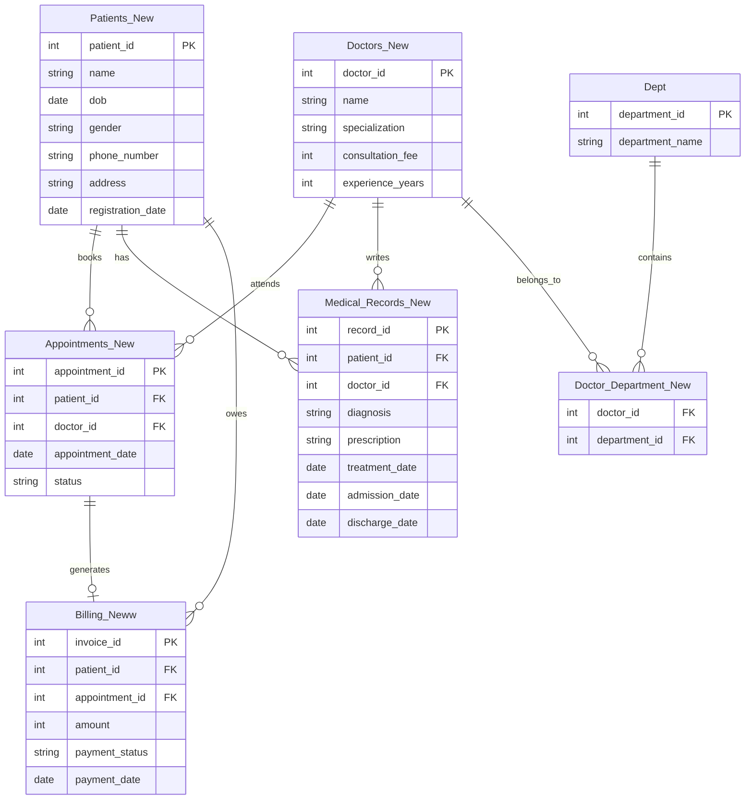

# Hospital_mangement_system.sql

<p align="center">
  
</p>

<h1 align="center">🏥 Hospital Management System</h1>
<h3 align="center">An end-to-end relational database project in SQL</h3>

<p align="center">
  
  
  
  
  
</p>

<p align="center">
  A full hospital back-office modeled in SQL — patients, doctors, appointments, medical records, billing and departments — built from the ground up with proper keys and constraints, seeded with realistic data, and queried with everything from a plain <code>WHERE</code> clause to <code>RANK() OVER (...)</code> window functions.
</p>

<p align="center">
  <a href="https://claude.ai/artifact/6NuoGCVjiosQTXdFQ5SRBz"><strong>🔴 Open the live query explorer →</strong></a>
  <br><sub>Every query in this README runs live on that page, against the real dataset — click a query, watch the result compute.</sub>
</p>

> 💡 The strip at the top is a live-typing terminal (a self-contained animated SVG, no JS, no external service) — it types out the project name and cycles through four real queries from this file, on a loop, right inside this README. Keep `banner.svg` next to `README.md` in the repo for it to animate on GitHub.

---

## 📑 Table of contents

- [Overview](#-overview)
- [Entity-relationship diagram](#-entity-relationship-diagram)
- [Schema reference](#-schema-reference)
- [Sample data](#-sample-data)
- [CRUD operations](#-crud-operations)
- [The full query catalogue](#-the-full-query-catalogue-30-queries)
- [Setup & how to run](#-setup--how-to-run)
- [Project structure](#-project-structure)
- [Skills this project demonstrates](#-skills-this-project-demonstrates)
- [Roadmap / ideas to extend it](#-roadmap--ideas-to-extend-it)
- [FAQ](#-faq)
- [License](#-license)

---

## 🔎 Overview

`Hospital_Managment_system.sql` is a single script that builds a small but complete hospital database and then puts it through its paces. It's organized in the order a real project actually gets built:

1. **Design the schema** — 7 tables, 5 foreign keys, sensible primary keys everywhere.
2. **Seed it with data** — 6 patients, 6 doctors, 5 departments, and matching appointments, medical records and invoices.
3. **Operate on it** — the CRUD statements a hospital's front desk would actually run: register a new patient, onboard a doctor, update an address, purge stale cancelled bookings.
4. **Interrogate it** — 30 SELECT queries, grouped by SQL concept, from a basic `WHERE` filter up to ranked, cumulative window functions.

It's built as a **learning artifact and portfolio piece**: every concept is demonstrated with a query that answers a genuine hospital-operations question (who's overdue, which department earns the most, which doctor is busiest), not a toy example.

---

## 🗺 Entity-relationship diagram



*(GitHub renders Mermaid diagrams natively — this shows as a real ER diagram, not a code block, once pushed to a repo.)*

---

## 🧱 Schema reference

7 tables, 5 foreign keys, one clean dependency chain: `Patients_New` and `Doctors_New` sit at the center, everything else references one or both of them.

### `Patients_New`
| Column | Type | Notes |
|---|---|---|
| `patient_id` | `INT` | **Primary key** |
| `name` | `VARCHAR(50)` | |
| `dob` | `DATE` | |
| `gender` | `VARCHAR(10)` | |
| `phone_number` | `VARCHAR(15)` | |
| `address` | `VARCHAR(100)` | |
| `registration_date` | `DATE` | |

### `Doctors_New`
| Column | Type | Notes |
|---|---|---|
| `doctor_id` | `INT` | **Primary key** |
| `name` | `VARCHAR(50)` | |
| `specialization` | `VARCHAR(50)` | |
| `consultation_fee` | `INT` | |
| `experience_years` | `INT` | |

### `Dept`
| Column | Type | Notes |
|---|---|---|
| `department_id` | `INT` | **Primary key** |
| `department_name` | `VARCHAR(50)` | |

### `Doctor_Department_New`
| Column | Type | Notes |
|---|---|---|
| `doctor_id` | `INT` | FK → `Doctors_New`, part of composite PK |
| `department_id` | `INT` | FK → `Dept`, part of composite PK |

### `Appointments_New`
| Column | Type | Notes |
|---|---|---|
| `appointment_id` | `INT` | **Primary key** |
| `patient_id` | `INT` | FK → `Patients_New` |
| `doctor_id` | `INT` | FK → `Doctors_New` |
| `appointment_date` | `DATE` | |
| `status` | `VARCHAR(20)` | `Completed` / `Scheduled` / `Cancelled` |

### `Medical_Records_New`
| Column | Type | Notes |
|---|---|---|
| `record_id` | `INT` | **Primary key** |
| `patient_id` | `INT` | FK → `Patients_New` |
| `doctor_id` | `INT` | FK → `Doctors_New` |
| `diagnosis` | `VARCHAR(100)` | |
| `prescription` | `VARCHAR(100)` | |
| `treatment_date` | `DATE` | |
| `admission_date` | `DATE` | |
| `discharge_date` | `DATE` | |

### `Billing_Neww`
| Column | Type | Notes |
|---|---|---|
| `invoice_id` | `INT` | **Primary key** |
| `patient_id` | `INT` | FK → `Patients_New` |
| `appointment_id` | `INT` | FK → `Appointments_New` |
| `amount` | `INT` | |
| `payment_status` | `VARCHAR(20)` | `Paid` / `Pending` / `Cancelled` |
| `payment_date` | `DATE` | nullable — unpaid/cancelled invoices have no date |

---

## 🧪 Sample data

The script seeds 5 patients, 5 doctors and 5 departments, then the CRUD block below adds a 6th patient and doctor. A snapshot of the seed data:

**Patients**

| id | name | gender | city | registered |
|---|---|---|---|---|
| 1 | Alice | Male | Ahmedabad | 2025-01-10 |
| 2 | Bob | Female | Ahmedabad | 2026-01-15 |
| 3 | Charlie | Female | Gandhinagar | 2026-03-10 |
| 4 | Johan | Male | Surat | 2024-08-20 |
| 5 | Carol | Female | Ahmedabad | 2026-02-05 |

**Doctors**

| id | name | specialization | fee | experience |
|---|---|---|---|---|
| 1 | Dr. Amit | Cardiology | ₹1500 | 18 yrs |
| 2 | Dr. Neha | Neurology | ₹1800 | 12 yrs |
| 3 | Dr. Rohan | Dermatology | ₹1200 | 7 yrs |
| 4 | Dr. Priya | Orthopedics | ₹1600 | 16 yrs |
| 5 | Dr. Isha | Pediatrics | ₹1000 | 4 yrs |

---

## ✏️ CRUD operations

The script's CRUD block is written the way a hospital's front-desk system would actually use it — one new patient, one new doctor, one new (and later stale) booking, one address correction, one cleanup delete:

```sql
-- Register a new patient
INSERT INTO Patients_New
VALUES (6,'Pooja','1997-03-21','Female','9876500006','Ahmedabad','2026-09-20');

-- Onboard a new doctor
INSERT INTO Doctors_New VALUES (6,'Dr. Raj','General Medicine',900,3);

-- Book (and later cancel) an appointment
INSERT INTO Appointments_New VALUES (110,6,6,'2025-01-15','Cancelled');

-- Patient moves house
UPDATE Patients_New
SET address = 'Maninagar'
WHERE patient_id = 6;

-- Housekeeping: purge cancelled appointments older than 6 months
DELETE FROM Appointments_New
WHERE status = 'Cancelled'
  AND appointment_date < CURRENT_DATE - INTERVAL '6 months';
```

That last `DELETE` is the one worth noticing — it's date-driven, so the row it removes depends on *when you run it*, not on a hardcoded ID. That's exactly the kind of query the live explorer computes fresh every time, which is why appointment `110` shows up as deleted there but the identical logic on a different day could keep or remove a different row.

---

## 📊 The full query catalogue (30 queries)

Every query below exists in `Hospital_Managment_system.sql` and is runnable live in the **[query explorer](https://claude.ai/artifact/6NuoGCVjiosQTXdFQ5SRBz)**.

### Filtering — `WHERE`, `HAVING`, `LIMIT`
<details>
<summary>Patients registered in the last year</summary>

```sql
SELECT * FROM Patients_New
WHERE registration_date >= CURRENT_DATE - INTERVAL '1 year';
```
</details>

<details>
<summary>Top 5 patients by total spend</summary>

```sql
SELECT patient_id, SUM(amount) AS total_spent
FROM Billing_Neww
GROUP BY patient_id
ORDER BY total_spent DESC
LIMIT 5;
```
</details>

<details>
<summary>Doctors charging above ₹1000</summary>

```sql
SELECT * FROM Doctors_New WHERE consultation_fee > 1000;
```
</details>

### Logic — `AND`, `OR`, `NOT`
<details>
<summary>Scheduled appointments with a specific doctor</summary>

```sql
SELECT * FROM Appointments_New
WHERE status = 'Scheduled' AND doctor_id = 3;
```
</details>

<details>
<summary>Cardiology or Neurology doctors</summary>

```sql
SELECT * FROM Doctors_New
WHERE specialization = 'Cardiology' OR specialization = 'Neurology';
```
</details>

<details>
<summary>Appointments that are not completed</summary>

```sql
SELECT * FROM Appointments_New WHERE NOT status = 'Completed';
```
</details>

### Grouping & ordering
<details>
<summary>Doctors ordered by specialization</summary>

```sql
SELECT * FROM Doctors_New ORDER BY specialization;
```
</details>

<details>
<summary>Appointment count per doctor</summary>

```sql
SELECT doctor_id, COUNT(*) AS total_patients
FROM Appointments_New GROUP BY doctor_id;
```
</details>

<details>
<summary>Revenue by department (multi-table join + aggregate)</summary>

```sql
SELECT dep.department_name, SUM(b.amount) AS total_revenue
FROM Dept dep
JOIN Doctor_Department_New dd ON dep.department_id = dd.department_id
JOIN Doctors_New d ON dd.doctor_id = d.doctor_id
JOIN Appointments_New a ON d.doctor_id = a.doctor_id
JOIN Billing_Neww b ON a.appointment_id = b.appointment_id
GROUP BY dep.department_name;
```
</details>

### Aggregate functions
<details>
<summary>Total revenue collected (paid invoices only)</summary>

```sql
SELECT SUM(amount) AS total_revenue
FROM Billing_Neww WHERE payment_status = 'Paid';
```
</details>

<details>
<summary>The single busiest doctor by visit count</summary>

```sql
SELECT doctor_id, COUNT(*) AS total_visits
FROM Appointments_New
GROUP BY doctor_id
ORDER BY total_visits DESC
LIMIT 1;
```
</details>

<details>
<summary>Average consultation fee across all doctors</summary>

```sql
SELECT AVG(consultation_fee) AS average_fee FROM Doctors_New;
```
</details>

### Joins — all four types
<details>
<summary>INNER JOIN — doctors and their department</summary>

```sql
SELECT d.name AS doctor_name, dep.department_name
FROM Doctors_New d
INNER JOIN Doctor_Department_New dd ON d.doctor_id = dd.doctor_id
INNER JOIN Dept dep ON dd.department_id = dep.department_id;
```
</details>

<details>
<summary>LEFT JOIN — every patient, with or without an appointment</summary>

```sql
SELECT p.name, a.appointment_id
FROM Patients_New p
LEFT JOIN Appointments_New a ON p.patient_id = a.patient_id;
```
</details>

<details>
<summary>RIGHT JOIN — every appointment, with or without billing</summary>

```sql
SELECT a.appointment_id, b.amount
FROM Billing_Neww b
RIGHT JOIN Appointments_New a ON b.appointment_id = a.appointment_id;
```
</details>

<details>
<summary>FULL OUTER JOIN — patients and appointments, matched or not</summary>

```sql
SELECT p.name, a.appointment_id
FROM Patients_New p
FULL OUTER JOIN Appointments_New a ON p.patient_id = a.patient_id;
```
</details>

### Subqueries
<details>
<summary>Doctors who've seen more than 50 distinct patients</summary>

```sql
SELECT doctor_id, name FROM Doctors_New
WHERE doctor_id IN (
  SELECT doctor_id FROM Appointments_New
  GROUP BY doctor_id
  HAVING COUNT(DISTINCT patient_id) > 50
);
```
</details>

<details>
<summary>The patient with the single highest bill total</summary>

```sql
SELECT patient_id, name FROM Patients_New
WHERE patient_id = (
  SELECT patient_id FROM Billing_Neww
  GROUP BY patient_id
  ORDER BY SUM(amount) DESC
  LIMIT 1
);
```
</details>

<details>
<summary>Every appointment under Dermatology</summary>

```sql
SELECT * FROM Appointments_New
WHERE doctor_id IN (
  SELECT doctor_id FROM Doctors_New WHERE specialization = 'Dermatology'
);
```
</details>

### Date & time functions
<details>
<summary>Visit volume by month</summary>

```sql
SELECT EXTRACT(MONTH FROM appointment_date) AS month, COUNT(*) AS visits
FROM Appointments_New
GROUP BY EXTRACT(MONTH FROM appointment_date);
```
</details>

<details>
<summary>Length of hospital stay per record</summary>

```sql
SELECT record_id, discharge_date - admission_date AS stay_days
FROM Medical_Records_New;
```
</details>

<details>
<summary>Treatment dates, formatted DD-MM-YYYY</summary>

```sql
SELECT TO_CHAR(treatment_date,'DD-MM-YYYY') AS treatment_date
FROM Medical_Records_New;
```
</details>

### String functions
<details>
<summary>Patient names, upper-cased</summary>

```sql
SELECT UPPER(name) FROM Patients_New;
```
</details>

<details>
<summary>Doctor names, whitespace-trimmed</summary>

```sql
SELECT TRIM(name) FROM Doctors_New;
```
</details>

<details>
<summary>Phone numbers with a readable fallback</summary>

```sql
SELECT COALESCE(phone_number,'Not Available') FROM Patients_New;
```
</details>

### Window functions
<details>
<summary>Rank doctors by distinct patients treated</summary>

```sql
SELECT doctor_id,
       COUNT(DISTINCT patient_id) AS total_patients,
       RANK() OVER (ORDER BY COUNT(DISTINCT patient_id) DESC) AS doctor_rank
FROM Appointments_New
GROUP BY doctor_id;
```
</details>

<details>
<summary>Cumulative revenue, month over month</summary>

```sql
SELECT TO_CHAR(payment_date,'YYYY-MM') AS month,
       SUM(amount) AS revenue,
       SUM(SUM(amount)) OVER (ORDER BY TO_CHAR(payment_date,'YYYY-MM')) AS cumulative_revenue
FROM Billing_Neww
WHERE payment_status = 'Paid'
GROUP BY TO_CHAR(payment_date,'YYYY-MM')
ORDER BY month;
```
</details>

<details>
<summary>Running total of appointments over time</summary>

```sql
SELECT appointment_id, appointment_date,
       COUNT(*) OVER (ORDER BY appointment_date) AS running_total
FROM Appointments_New
ORDER BY appointment_date;
```
</details>

### CASE logic
<details>
<summary>Patient risk level, from medical record history</summary>

```sql
SELECT p.name,
       COUNT(m.record_id) AS records,
       CASE
           WHEN COUNT(m.record_id) > 5 THEN 'High'
           WHEN COUNT(m.record_id) BETWEEN 3 AND 5 THEN 'Medium'
           ELSE 'Low'
       END AS patient_risk_level
FROM Patients_New p
LEFT JOIN Medical_Records_New m ON p.patient_id = m.patient_id
GROUP BY p.patient_id, p.name;
```
</details>

<details>
<summary>Doctor seniority tier, from years of experience</summary>

```sql
SELECT name, experience_years,
       CASE
           WHEN experience_years > 15 THEN 'Senior'
           WHEN experience_years BETWEEN 5 AND 15 THEN 'Mid-Level'
           ELSE 'Junior'
       END AS category
FROM Doctors_New;
```
</details>

---

## ⚙️ Setup & how to run

**Requirements:** PostgreSQL (the script uses Postgres-specific syntax — `INTERVAL`, `TO_CHAR`, `EXTRACT`). Adjust these three functions if porting to MySQL or SQL Server.

```bash
# 1. Create a database
createdb hospital_management

# 2. Load the schema, seed data, CRUD ops and all 30 queries
psql -d hospital_management -f Hospital_Managment_system.sql

# 3. Run any single query directly, e.g.
psql -d hospital_management -c "SELECT * FROM Doctors_New WHERE consultation_fee > 1000;"
```

Prefer not to install anything? Open the **[live query explorer](https://claude.ai/artifact/6NuoGCVjiosQTXdFQ5SRBz)** — every query above runs there instantly, against the same dataset, with zero setup.

---

## 📁 Project structure

```
hospital-management-sql/
├── Hospital_Managment_system.sql   # schema + seed data + CRUD + 30 queries
├── README.md                       # you are here
└── banner.svg                      # animated live-typing terminal (used by the README)
```

---

## 🧠 Skills this project demonstrates

| Area | Concepts covered |
|---|---|
| **Schema design** | Primary keys, composite keys, foreign keys, referential integrity across 7 tables |
| **Data manipulation** | `INSERT`, `UPDATE`, conditional `DELETE` |
| **Filtering & logic** | `WHERE`, `HAVING`, `LIMIT`, `AND` / `OR` / `NOT` |
| **Aggregation** | `GROUP BY`, `ORDER BY`, `SUM`, `COUNT`, `AVG` |
| **Joins** | `INNER`, `LEFT`, `RIGHT`, `FULL OUTER` |
| **Subqueries** | Scalar subqueries, `IN (...)` subqueries, correlated `HAVING` |
| **Date & time** | `EXTRACT`, date arithmetic, `TO_CHAR` formatting |
| **String handling** | `UPPER`, `TRIM`, `COALESCE` for null-safety |
| **Window functions** | `RANK() OVER`, running totals, cumulative sums |
| **Conditional logic** | Multi-branch `CASE` expressions for classification |

---

## 🛣 Roadmap / ideas to extend it

- [ ] Add a `Staff_New` table (nurses, admin) with its own department mapping
- [ ] Add indexes on foreign key columns and benchmark query plans with `EXPLAIN ANALYZE`
- [ ] Add a stored procedure for booking an appointment + generating its invoice in one transaction
- [ ] Port the date/string functions to a MySQL- and SQL Server-compatible version
- [ ] Add row-level constraints (e.g. `CHECK (discharge_date >= admission_date)`)

Contributions and forks welcome — this is meant as a living reference, not a one-off assignment.

---

## ❓ FAQ

**Why do some tables have odd names like `Billing_Neww`?**
The project evolved incrementally (`_New`, `Neww` suffixes were added while iterating on the schema) — kept as-is here since the live explorer and every query reference these exact names.

**Why PostgreSQL specifically?**
`INTERVAL` arithmetic, `TO_CHAR`, and `EXTRACT` are used throughout for the date-heavy queries (the 6-month cleanup delete, monthly revenue rollups) — these are cleanest in Postgres. MySQL/SQL Server equivalents exist (`DATE_SUB`, `DATE_FORMAT`, etc.) but aren't drop-in replacements.

**Does the animated banner slow the README down?**
No — it's a single ~5 KB SVG with declarative animation (SMIL), not a video or GIF. It costs about the same as a static image.

---

## 📄 License

Released under the **MIT License** — use it, fork it, extend it for your own portfolio or coursework.

<p align="center"><sub>Built as a hands-on SQL portfolio project — patients, doctors, and hopefully no real hospital was inconvenienced.</sub></p>
